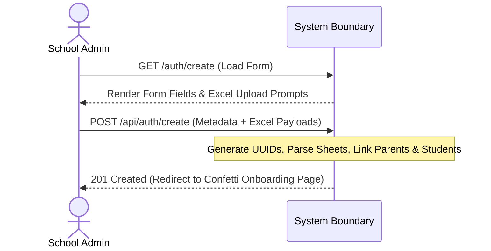
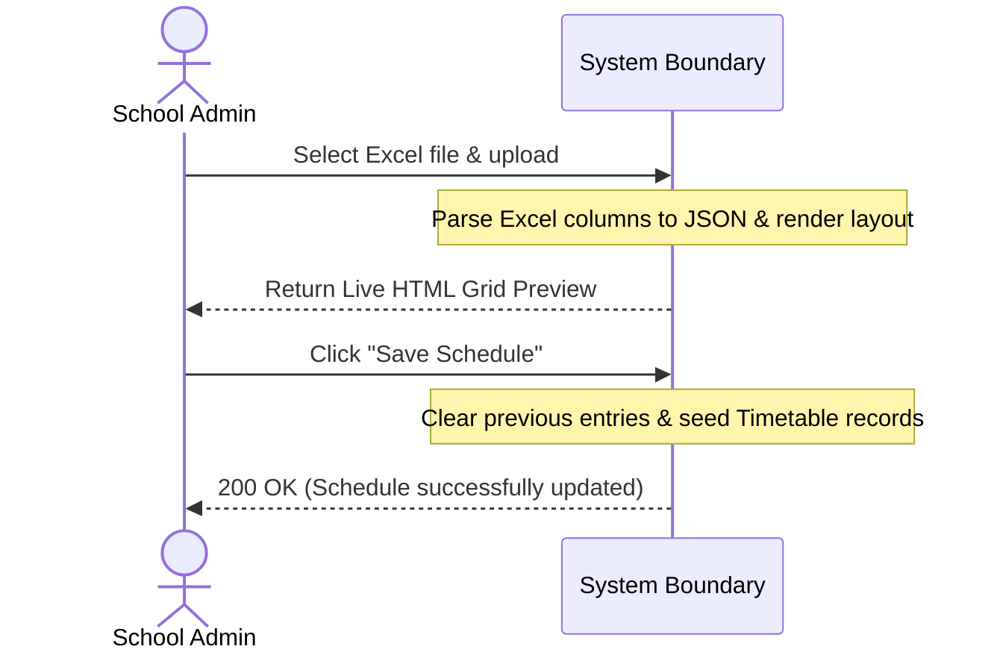
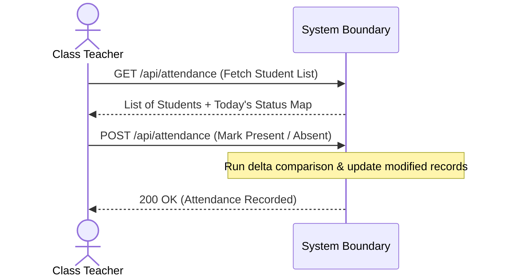
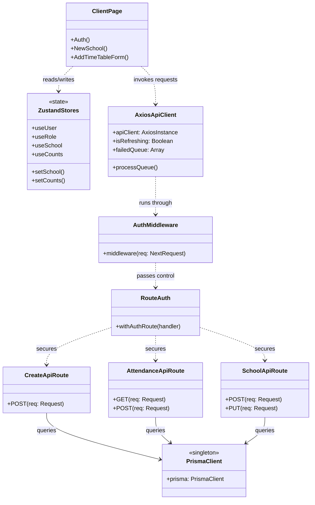
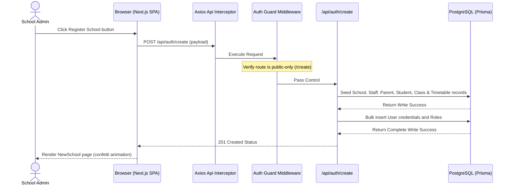
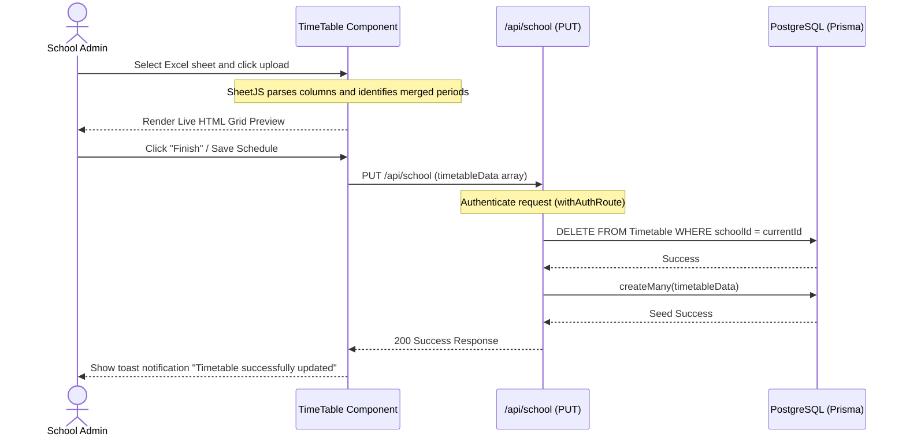
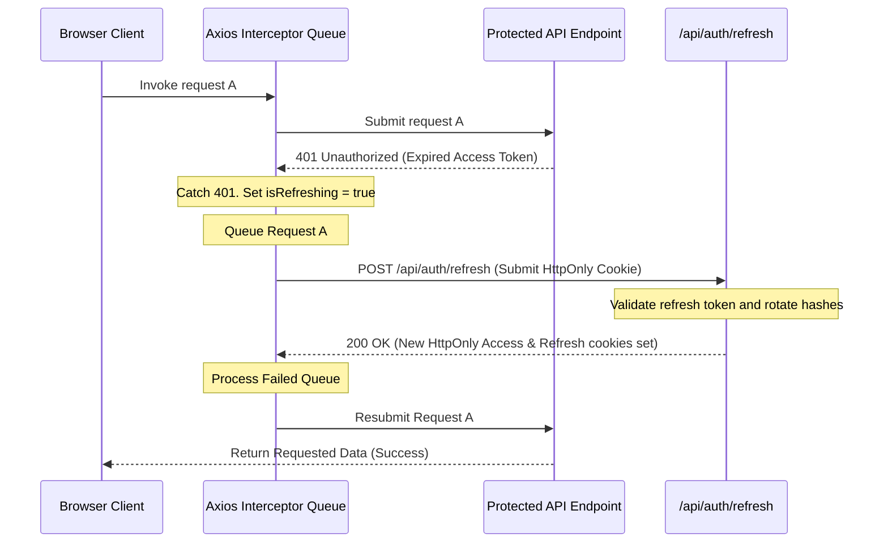

# 📖 UNIVERSITY COMMUNITY COLLEGE, GC UNIVERSITY, FAISALABAD
## FINAL PROJECT THESIS DOCUMENTATION
### Associate Degree in Software Technologies

---

## 📄 TITLE PAGE

```text
       EDUSTREAM: MULTI-TENANT ENTERPRISE SCHOOL MANAGEMENT SYSTEM
            WITH BRAND-ISOLATION AND AUTOMATED SMTP ONBOARDING

                                   By,
                       USMAN ALI (Reg. # 2024-GCUF-1234)
                      PARTNER ONE (Reg. # 2024-GCUF-5678)
                      PARTNER TWO (Reg. # 2024-GCUF-9012)

             Project submitted in partial fulfillment of the
                        requirements of the degree of

                              ASSOCIATE DEGREE
                                     IN
                            SOFTWARE TECHNOLOGIES


                         UNIVERSITY COMMUNITY COLLEGE
                         GC UNIVERSITY, FAISALABAD

                                 June 2026
```

---

## ℹ️ TABLE FORMATTING GUIDE FOR THESIS PRINTING
> [!IMPORTANT]
> **GCUF Thesis Layout Settings (To be adjusted in MS Word before printing):**
> - **Paper Size**: A-4 (210mm x 297mm)
> - **Margins**: Left: 1.25 inches (for binding), Right: 1.00 inch, Top: 1.00 inch, Bottom: 1.00 inch
> - **Base Font**: Times New Roman (Justified alignment, 1.5 line spacing)
> - **Headings Styling**:
>   - **Chapter Title**: Font Size 16, Bold, ALL CAPS, Centered
>   - **Heading 1 (Main)**: Font Size 14, Bold, Left-Aligned
>   - **Heading 2 (Sub-heading)**: Font Size 12, Bold, Left-Aligned
> - **Page Numbers**: Bottom Right.
>   - Title pages must have no page numbers.
>   - Front matter (Abstract, TOC, Lists) must be numbered using lowercase Roman numerals (`i`, `ii`, `iii`).
>   - Chapter-1 onwards must start at Page 1 using Arabic numerals (`1`, `2`, `3`).

---

## 📝 ABSTRACT

EduStream is a tenant-isolated, high-performance School Management System (SMS) built using Next.js 15, PostgreSQL, and Prisma ORM. The platform provides a modern solution for educational administration, connecting administrators, staff, students, and parents into a secure, cohesive web workspace. Unlike conventional educational platforms that rely on generic visual layouts, EduStream introduces a brand-isolation engine where schools can upload custom logos and configure brand colors. These branding preferences are loaded dynamically at runtime, transforming the visual identity of all system dashboards (Admin, Staff, Student, and Parent). 

The application resolves several common operational bottlenecks in school management:
1. **Onboarding Complexity**: A single transactional API route processes a unified payload containing teachers, students, parent contact registries, classes, and subjects, dynamically establishing parent-student foreign key relationships on the fly.
2. **Timetable Structuring**: An integrated uploader parsed through SheetJS extracts schedule coordinates directly from Excel spreadsheets, identifying merged periods, classrooms, and subject spans to construct the school's master schedule instantly.
3. **Security and Session Integrity**: A stateless JSON Web Token (JWT) architecture using HTTP-Only secure cookies protects user sessions, supported by a server-side tracking database and a client-side request queue that manages token refreshes silently.
4. **Attendance Insights**: Teachers are provided with an attendance roll-call interface that supports incremental state updates. The system dynamically aggregates this data, generating weekly and monthly attendance charts on the dashboard.

This thesis details the Software Requirement Specification (SRS), analysis, architecture, database models, implementation files, and verification test cases of EduStream, validating it as a modern enterprise-grade educational software product.

---

## 🗺️ TABLE OF CONTENTS
- **Title Page**
- **Abstract**
- **Table of Contents**
- **List of Tables**
- **List of Figures**
- **CHAPTER-1: SOFTWARE REQUIREMENT SPECIFICATION (SRS)**
  - 1.1 Introduction
  - 1.2 Stakeholders
  - 1.3 Users of the System
  - 1.4 Functional Requirements
    - 1.4.1 List of Functional Requirements
    - 1.4.2 Description of Requirements in Requirement Shell
  - 1.5 Non-Functional Requirements
  - 1.6 Schedule of Project
- **CHAPTER-2: ANALYSIS**
  - 2.1 Use Case Model
  - 2.2 Fully Dressed Use Cases
  - 2.3 System Sequence Diagrams (SSDs)
  - 2.4 Domain Model
- **CHAPTER-3: DESIGN**
  - 3.1 Design Class Diagram
  - 3.2 Entity Relationship Diagram (ERD)
  - 3.3 Sequence Diagrams
- **CHAPTER-4: IMPLEMENTATION**
  - 4.1 Master Onboarding and Dynamic Mapping Engine
  - 4.2 SheetJS Timetable Parsing Script
  - 4.3 Silent Token Refresh Queuing Client Interceptor
  - 4.4 High-Performance Dashboard Metric Aggregator API
- **CHAPTER-5: TESTING**
  - 5.1 Test Strategy
  - 5.2 Formatted Test Cases
- **GLOSSARY**

---

## 📊 LIST OF TABLES
*   **Table 1.1**: List of Stakeholders
*   **Table 1.2**: User Persona Profiles
*   **Table 1.3**: Functional Requirements Register
*   **Table 1.4**: SRS Requirement Shell - School Workspace Onboarding (Req01)
*   **Table 1.5**: SRS Requirement Shell - User Authentication & Session (Req02)
*   **Table 1.6**: SRS Requirement Shell - Excel Timetable Spreadsheet Parsing (Req03)
*   **Table 1.7**: SRS Requirement Shell - Daily Attendance Roll Call (Req04)
*   **Table 1.8**: SRS Requirement Shell - Nodemailer Password Dispatch (Req05)
*   **Table 1.9**: Project Schedule Work Breakdown Structure (WBS)
*   **Table 2.1**: Fully Dressed Use Case - UC01: Bootstrap School Workspace
*   **Table 2.2**: Fully Dressed Use Case - UC02: Parse Timetable Sheet
*   **Table 2.3**: Fully Dressed Use Case - UC03: Submit Attendance
*   **Table 5.1**: Test Case TC01 - School Workspace Onboarding (Pass Scenario)
*   **Table 5.2**: Test Case TC02 - School Workspace Onboarding (Fail Scenario)
*   **Table 5.3**: Test Case TC03 - Timetable Excel Parsing (Pass Scenario)
*   **Table 5.4**: Test Case TC04 - Timetable Excel Parsing (Fail Scenario)
*   **Table 5.5**: Test Case TC05 - Daily Attendance Submission (Pass Scenario)

---

## 🖼️ LIST OF FIGURES
*   **Figure 1.1**: Project Development Timeline (Gantt Chart Representation)
*   **Figure 2.1**: System Use Case Diagram
*   **Figure 2.2**: System Sequence Diagram (SSD) - Bootstrapping a School Workspace
*   **Figure 2.3**: System Sequence Diagram (SSD) - Excel Timetable Parsing
*   **Figure 2.4**: System Sequence Diagram (SSD) - Attendance Roll Call
*   **Figure 2.5**: Domain Model Diagram
*   **Figure 3.1**: Design Class Diagram
*   **Figure 3.2**: crow's foot notation Entity Relationship Diagram (ERD)
*   **Figure 3.3**: Technical Sequence Diagram - School Workspace Initialization
*   **Figure 3.4**: Technical Sequence Diagram - Timetable Integration
*   **Figure 3.5**: Technical Sequence Diagram - JWT Token Refresh Lifecycle

---
\pagebreak

# CHAPTER-1: SOFTWARE REQUIREMENT SPECIFICATION (SRS)

## 1.1 Introduction
The Software Requirement Specification (SRS) provides a comprehensive description of the functional and non-functional requirements for the EduStream School Management System. Educational administrative tasks are often fragmented across disparate systems, leading to high operational costs, data inconsistencies, and poor communication. EduStream addresses these issues by offering a tenant-isolated, multi-tenant workspace architecture. This system consolidates administrative processes, custom school branding, automated onboarding, class scheduling, and real-time attendance analytics into a single, cohesive application.

## 1.2 Stakeholders
A stakeholder is any individual, group, or organization that has a direct or indirect interest in the system's success. The table below lists the primary stakeholders identified for EduStream:

##### Table 1.1: List of Stakeholders
| Stakeholder ID | Stakeholder Name | Description / Interest in the System |
| :--- | :--- | :--- |
| **ST01** | **School Administrators** | Primarily interested in centralized school management, onboarding controls, custom color branding, and general oversight. |
| **ST02** | **Academic Faculty / Teachers** | Interested in efficient tools for daily class attendance, viewing personalized timetables, and communicating with parents. |
| **ST03** | **Students** | Interested in accessing real-time schedules, announcements, and course timetables from any device. |
| **ST04** | **Parents / Guardians** | Interested in monitoring their children's timetables and receiving school communications. |
| **ST05** | **IT Operations & Security Team** | Interested in robust system security, JWT token lifecycle management, database integrity, and high-performance server APIs. |
| **ST06** | **GCUF Project Evaluators** | Interested in evaluating the system's academic and technical implementation for project compliance. |

## 1.3 Users of the System
The system's users represent the actors who interact directly with the application interface. The user roles and access levels are defined as follows:

##### Table 1.2: User Persona Profiles
| User Role | Access Level | Responsibilities |
| :--- | :--- | :--- |
| **Super Admin** | Platform Owner | Manages the global multi-tenant settings, registers new school tenants, and monitors overall system health. |
| **School Admin** | School Workspace Owner | Configures school branding, uploads timetables, registers staff, students, and parents, and manages access. |
| **Teacher** | Class Inspector | Views assigned schedules, lists students, records daily attendance roll calls, and posts announcements. |
| **Student** | Learner Access | Views individual schedules, check announcements, and reviews subjects. |
| **Parent** | Guardian Portal | Tracks multiple children's class timetables, and views school announcements. |
| **Non-Teaching Staff** | Operations Staff | Accesses specific administrative utilities and listings as permitted. |

## 1.4 Functional Requirements
Functional requirements define the core behaviors and calculations that the system must execute.

### 1.4.1 List of Functional Requirements
The functional requirements identified for EduStream are listed below:

##### Table 1.3: Functional Requirements Register
| Req ID | Requirement Name | Priority | Description |
| :--- | :--- | :---: | :--- |
| **Req01** | **School Workspace Onboarding** | High | Enables admins to create a custom branded school workspace, registering teachers, classes, parents, and students in one flow. |
| **Req02** | **User Authentication & Session** | High | Handles secure user login, Bcrypt credential verification, JWT token issuance, and database-backed session tracking. |
| **Req03** | **Excel Timetable Parsing** | Medium | Parses horizontally merged periods from an uploaded Excel file, creating structured database records and HTML views. |
| **Req04** | **Daily Attendance Roll Call** | High | Enables class teachers to submit and modify daily attendance records with automated system status updates. |
| **Req05** | **Nodemailer Password Dispatch** | Medium | Generates password activation tokens and dispatches welcome emails to new users via SMTP. |

### 1.4.2 Description of Requirements in Requirement Shell
The functional requirements are detailed in the official GCUF Requirement Shell format below:

##### Table 1.4: SRS Requirement Shell - School Workspace Onboarding (Req01)
| Requirement Shell Field | Description / Value |
| :--- | :--- |
| **Requirement Name** | Manage School Workspace Onboarding |
| **Requirement #** | **Req01** |
| **Requirement Type**| Functional |
| **Description** | This requirement enables a School Admin to onboard an entire school workspace in a single transaction, registering school branding configurations, staff, classes, parents, students, and timetable grids. |
| **Rationale** | To eliminate the need for multi-step, error-prone manual entry of interrelated school entities. |
| **Originator** | School Administrator |
| **Fit Criterion** | The school workspace is created, related tables are populated, and all corresponding login accounts are generated successfully. |
| **Customer Satisfaction** | **5** (Extremely satisfied with the single-payload onboarding process) |
| **Customer Dissatisfaction** | **10** (Extremely dissatisfied if forced to enter hundreds of entities manually) |
| **Priority** | **5** (Critical / High Priority) |
| **Conflicts** | Nil |
| **Supporting Materials**| API schema payload structure for school onboarding. |
| **History** | Created May 17, 2026. Version 1.0. |

##### Table 1.5: SRS Requirement Shell - User Authentication & Session (Req02)
| Requirement Shell Field | Description / Value |
| :--- | :--- |
| **Requirement Name** | Authenticate User & Issue Token Sessions |
| **Requirement #** | **Req02** |
| **Requirement Type**| Functional |
| **Description** | Validates user credentials using Bcrypt, generates short-term Access Tokens (15M) and long-term Refresh Tokens (1W), sets secure HTTP-Only cookies, and records the session hash in the database. |
| **Rationale** | To protect system data and maintain secure sessions without using resource-intensive server-side session stores. |
| **Originator** | Security Architect |
| **Fit Criterion** | Users are authenticated, cookies are set securely, session logs are created in the database, and expired tokens refresh silently. |
| **Customer Satisfaction** | **4** (High satisfaction with seamless role-based navigation and silent refreshes) |
| **Customer Dissatisfaction** | **9** (High dissatisfaction if session management is insecure or requires constant re-logins) |
| **Priority** | **5** (Critical / High Priority) |
| **Conflicts** | Nil |
| **Supporting Materials**| Next.js Auth Middleware ([src/middleware.ts](file:///Users/macbookpro/projects/school/School-Management-System/src/middleware.ts)) |
| **History** | Created May 17, 2026. Version 1.0. |

##### Table 1.6: SRS Requirement Shell - Excel Timetable Spreadsheet Parsing (Req03)
| Requirement Shell Field | Description / Value |
| :--- | :--- |
| **Requirement Name** | Parse Timetable from Excel Uploads |
| **Requirement #** | **Req03** |
| **Requirement Type**| Functional |
| **Description** | Converts an uploaded Excel timetable sheet to JSON and HTML grids, resolving merged column cells to calculate period spans, subjects, and times. |
| **Rationale** | To enable administrators to import and preview complex academic timetables directly from Excel. |
| **Originator** | Registrar / Administrator |
| **Fit Criterion** | The uploaded Excel is processed, merged cells are parsed correctly, data is saved, and a calendar preview renders. |
| **Customer Satisfaction** | **5** (High satisfaction with automated layout extraction) |
| **Customer Dissatisfaction** | **8** (Dissatisfaction if required to build complex timetable grids cell-by-cell) |
| **Priority** | **3** (Medium Priority) |
| **Conflicts** | Nil |
| **Supporting Materials**| SheetJS Timetable Uploader ([AddTimeTable.tsx](file:///Users/macbookpro/projects/school/School-Management-System/src/components/forms/AddTimeTable.tsx)) |
| **History** | Created May 17, 2026. Version 1.0. |

##### Table 1.7: SRS Requirement Shell - Daily Attendance Roll Call (Req04)
| Requirement Shell Field | Description / Value |
| :--- | :--- |
| **Requirement Name** | Manage Daily Attendance Roll Call |
| **Requirement #** | **Req04** |
| **Requirement Type**| Functional |
| **Description** | Enables teachers to retrieve student directories, record attendance, and perform database updates to minimize writes. |
| **Rationale** | To track student attendance and generate weekly and monthly analytics. |
| **Originator** | Class Teacher |
| **Fit Criterion** | The student list is loaded, attendance states are recorded, and updates apply only to modified records. |
| **Customer Satisfaction** | **4** (High satisfaction with simple, quick roll-call views) |
| **Customer Dissatisfaction** | **9** (High dissatisfaction if recording attendance is slow or requires manual paper tracking) |
| **Priority** | **4** (High Priority) |
| **Conflicts** | Nil |
| **Supporting Materials**| API Attendance Route Handler ([src/app/api/attendance/route.ts](file:///Users/macbookpro/projects/school/School-Management-System/src/app/api/attendance/route.ts)) |
| **History** | Created May 17, 2026. Version 1.0. |

##### Table 1.8: SRS Requirement Shell - Nodemailer Password Dispatch (Req05)
| Requirement Shell Field | Description / Value |
| :--- | :--- |
| **Requirement Name** | Asynchronous Password Dispatch and Onboarding |
| **Requirement #** | **Req05** |
| **Requirement Type**| Functional |
| **Description** | Dispatches welcoming invitation email containing account confirmation token via Nodemailer secure SMTP layer. |
| **Rationale** | To ensure users verify their email addresses and establish secure passwords during the onboarding process. |
| **Originator** | System Security Administrator |
| **Fit Criterion** | An invitation email containing a secure token is sent, the user clicks the link, and the system hashes the password and activates the account. |
| **Customer Satisfaction** | **5** (High satisfaction with automated email invitations and password setup) |
| **Customer Dissatisfaction** | **10** (High dissatisfaction if passwords are set manually or accounts are not verified) |
| **Priority** | **3** (Medium Priority) |
| **Conflicts** | Nil |
| **Supporting Materials**| API Confirmation Route Handler ([confirm/route.ts](file:///Users/macbookpro/projects/school/School-Management-System/src/app/api/auth/confirm/route.ts)) |
| **History** | Created May 17, 2026. Version 1.0. |

## 1.5 Non-Functional Requirements
Non-functional requirements specify qualitative attributes of the software, defining system constraints and performance metrics.
- **NF-01: Performance**: Dashboard analytics queries must run concurrently using `Promise.all` aggregators. Average API response times must remain under **300ms** on local setups.
- **NF-02: Security**: Unhashed credentials must not be stored in the database. JWT Access Tokens must expire in **15 minutes** and use the `HttpOnly` cookie parameter.
- **NF-03: Usability**: The client interface must support responsive scaling, adapting from mobile devices to desktop displays via Tailwind CSS viewport breakpoints.
- **NF-04: Reliability**: Prisma connection pools must utilize singleton patterns to prevent connection leaks during hot-reloads.
- **NF-05: Portability (PWA)**: The system must include a Progressive Web App (PWA) manifest and service worker, making it installable on Android, iOS, Windows, and macOS.

## 1.6 Schedule of Project
The project schedule is structured across the standard phases of the **Unified Process (UP) lifecycle**:

##### Table 1.9: Project Schedule Work Breakdown Structure (WBS)
| Phase Name | Sub-Tasks | Duration | Deliverables |
| :--- | :--- | :---: | :--- |
| **Inception** | Feasibility Study, Scope Formulation, SRS Analysis. | 2 Weeks | SRS Document, Requirement Register. |
| **Elaboration** | Architecture Design, Domain Modeling, Database Schema. | 3 Weeks | ERD, Design Diagrams, PostgreSQL Scripts. |
| **Construction** | Database Migration, API Implementation, Frontend Development. | 6 Weeks | Functional Software Modules, State Stores. |
| **Transition** | Beta Testing, Performance Optimization, Deployment. | 2 Weeks | Production Build, Test Reports, Final Thesis. |

##### Figure 1.1: Project Development Timeline (Gantt Chart Representation)
```text
Inception    : [████               ] 2 Weeks
Elaboration  : [    ██████         ] 3 Weeks
Construction : [          ████████ ] 6 Weeks
Transition   : [                  █] 2 Weeks
```

---
\pagebreak

# CHAPTER-2: ANALYSIS

## 2.1 Use Case Model
The Use Case Model defines the interactions between the system's actors and its key functionalities.

##### Figure 2.1: System Use Case Diagram
```mermaid
rect bg-primary-light
    classDef actorStyle fill:#f9f,stroke:#333,stroke-width:2px;
    classDef ucStyle fill:#bbf,stroke:#333,stroke-width:1px;

    subgraph EduStream App Boundary
        UC01((Bootstrap School Workspace)) ::: ucStyle
        UC02((Parse Timetable Sheet)) ::: ucStyle
        UC03((Submit Daily Attendance)) ::: ucStyle
        UC04((View Student Schedule)) ::: ucStyle
        UC05((View Announcements)) ::: ucStyle
    end

    Admin((School Admin)) ::: actorStyle
    Teacher((Class Teacher)) ::: actorStyle
    Student((Student)) ::: actorStyle
    Parent((Parent)) ::: actorStyle

    Admin --> UC01
    Admin --> UC02
    Teacher --> UC03
    Teacher --> UC05
    Student --> UC04
    Student --> UC05
    Parent --> UC04
    Parent --> UC05
```

## 2.2 Fully Dressed Use Cases
The critical use cases are detailed in the fully dressed format below:

##### Table 2.1: Fully Dressed Use Case - UC01: Bootstrap School Workspace
| Use Case Element | Description / Details |
| :--- | :--- |
| **Use Case Name** | **Bootstrap School Workspace** |
| **UC #** | **UC01** |
| **Ref. Req. #** | **Req01** |
| **Level** | Detailed |
| **Description** | Initiates the onboarding process for a new school tenant by seeding branding parameters, classes, staff, parents, students, and timetables in a single operation. |
| **Actor(s)** | School Administrator |
| **Stakeholders** | School Admin, Academic Faculty, Students, Parents, IT Operations |
| **Preconditions** | The administrator has loaded the system's onboarding interface and prepared the entity Excel sheets. |
| **Success Guarantee** | The school workspace is created, and all student, parent, staff, class, and timetable records are generated successfully. |
| **Main Success Scenario (Action/Response)** | <br>**Actor Action**:<br>1. Access the school registration portal.<br>2. Enter school metadata (principal name, HSL color codes).<br>3. Upload student, parent, and teacher Excel lists.<br>4. Upload the master timetable sheet.<br>5. Click "Submit" to complete registration.<br><br>**System Response**:<br>6. Validate the uploaded payload.<br>7. Generate unique UUIDs for the school workspace and its entities.<br>8. Parse student records and map parent contact IDs.<br>9. Parse the uploaded Excel timetable to populate schedules.<br>10. Bulk insert all records into the database.<br>11. Generate user accounts and email activation invites.<br>12. Display a success message with custom branding colors. |
| **Extensions** | **4a. Invalid Excel Format**:<br>  - System terminates the upload, displays a validation error, and prompts the user to upload a valid template. |
| **Special Requirements** | The parent-student linking engine must resolve relations within 5 seconds for uploads containing up to 500 students. |
| **Frequency** | Once per school workspace registration. |
| **Miscellaneous** | Utilizes transactional batching to guarantee data consistency. |

##### Table 2.2: Fully Dressed Use Case - UC02: Parse Timetable Sheet
| Use Case Element | Description / Details |
| :--- | :--- |
| **Use Case Name** | **Parse Timetable Sheet** |
| **UC #** | **UC02** |
| **Ref. Req. #** | **Req03** |
| **Level** | Detailed |
| **Description** | Parses timetable records from an Excel sheet to populate database tables and generate calendar layouts. |
| **Actor(s)** | School Administrator |
| **Stakeholders** | Administrators, Class Teachers, Students, Parents |
| **Preconditions** | The school workspace has been registered, and the classes and subjects are defined. |
| **Success Guarantee** | The uploaded Excel timetable is parsed, merged periods are mapped correctly, and schedules are saved to the database. |
| **Main Success Scenario (Action/Response)** | <br>**Actor Action**:<br>1. Access the settings panel and click "Upload Timetable".<br>2. Select the timetable Excel file.<br>3. Review the parsed HTML grid preview.<br>4. Click "Save Schedule" to update the database.<br><br>**System Response**:<br>5. Parse the Excel file using SheetJS.<br>6. Map table rows to day and class coordinates.<br>7. Resolve merged cells to calculate multi-period spans.<br>8. Generate and display an HTML preview of the timetable.<br>9. Delete old timetable records for the school.<br>10. Save the new parsed schedule records to the database. |
| **Extensions** | **5a. Merged Period Parsing Error**:<br>  - System detects a format mismatch, flags the incorrect coordinates, and prompts the administrator to correct the sheet. |
| **Special Requirements** | Supports merged Excel columns representing multi-period slots. |
| **Frequency** | Executed during initial setup or schedule updates. |
| **Miscellaneous** | Nil |

##### Table 2.3: Fully Dressed Use Case - UC03: Submit Attendance
| Use Case Element | Description / Details |
| :--- | :--- |
| **Use Case Name** | **Submit Daily Attendance** |
| **UC #** | **UC03** |
| **Ref. Req. #** | **Req04** |
| **Level** | Detailed |
| **Description** | Enables teachers to retrieve student lists, mark today's attendance roll call, and update records. |
| **Actor(s)** | Class Teacher |
| **Stakeholders** | Class Teachers, Parents, School Administration |
| **Preconditions** | The teacher is logged in and assigned as the primary teacher for a class containing registered students. |
| **Success Guarantee** | Daily attendance is submitted, database records are updated, and dashboard charts refresh. |
| **Main Success Scenario (Action/Response)** | <br>**Actor Action**:<br>1. Open the "Daily Attendance" panel.<br>2. Select the class to load the student list.<br>3. Mark students as Present or Absent.<br>4. Click "Submit Attendance".<br><br>**System Response**:<br>5. Verify the teacher's credentials and class assignment.<br>6. Check for existing attendance records for the selected date.<br>7. Identify modified records to perform a delta comparison.<br>8. Insert new attendance records and update modified ones.<br>9. Return a confirmation message to the teacher dashboard. |
| **Extensions** | **6a. Attendance Already Complete**:<br>  - System loads the submitted record, enabling the teacher to modify individual statuses. |
| **Special Requirements** | Daily roll call forms must be locked at the end of the school day. |
| **Frequency** | Once daily per assigned class. |
| **Miscellaneous** | Nil |

## 2.3 System Sequence Diagrams (SSDs)
System Sequence Diagrams illustrate the transactional messages that pass between an actor and the system boundary.

##### Figure 2.2: System Sequence Diagram (SSD) - Bootstrapping a School Workspace


##### Figure 2.3: System Sequence Diagram (SSD) - Excel Timetable Parsing


##### Figure 2.4: System Sequence Diagram (SSD) - Attendance Roll Call


## 2.4 Domain Model
The Domain Model represents key real-world conceptual entities and their relationships within the school system.

##### Figure 2.5: Domain Model Diagram
```mermaid
classDiagram
    class School {
        id
        name
        address
        brandingColors
        principalName
    }
    class User {
        id
        name
        email
        role
    }
    class Staff {
        oracleNo
        registrationNo
        designation
        teaching
    }
    class Student {
        registrationNo
        admissionNo
        class
        gender
    }
    class Parent {
        phoneNo
        address
    }
    class Timetable {
        day
        startTime
        endTime
        subject
        period
    }
    class Attendance {
        date
        status
    }

    School "1" --o{ User : registers
    School "1" --o{ Timetable : maintains
    User <|-- Staff : inherits
    User <|-- Student : inherits
    User <|-- Parent : inherits
    Parent "1" --o{ Student : guardians
    Student "1" --o{ Attendance : has
    Class "1" --o{ Attendance : has
```

---
\pagebreak

# CHAPTER-3: DESIGN

## 3.1 Design Class Diagram
The Design Class Diagram illustrates the technical software classes, components, handlers, and state management interfaces that form the application.

##### Figure 3.1: Design Class Diagram


## 3.2 Entity Relationship Diagram (ERD)
The crow's foot notation Entity Relationship Diagram represents the physical tables, primary/foreign keys, and database constraints in PostgreSQL.

##### Figure 3.2: crow's foot notation Entity Relationship Diagram (ERD)
```mermaid
erDiagram
    SCHOOL {
        String id PK
        String name
        String address
        String primaryColor
        String secondaryColor
        String logo
        String principal
        String slogan
        SchoolType type
        String timetableHtml
    }
    USER {
        String id PK
        String name
        String email UK
        String password
        Role role
        String schoolId FK
        String resetToken
        DateTime resetTokenExpiry
        String tempPassword
    }
    REFRESH_TOKENS {
        String id PK
        String userId FK
        String tokenHash UK
        String deviceInfo
        String ipAddress
        DateTime createdAt
        DateTime expiresOn
    }
    STAFF {
        String id PK, FK
        String name
        String email UK
        String registrationNo
        String designation
        Boolean teaching
        Boolean admin
        String[] classesTeaching
    }
    PARENT {
        String id PK, FK
        String email UK
        String name
        String phoneNo
        String address
    }
    STUDENT {
        String id PK, FK
        String name
        String email UK
        String parentId FK
        String class
        Gender gender
    }
    CLASS {
        String id PK
        String name
        String classTeacher
        String schoolId FK
    }
    TIMETABLE {
        String id PK
        String day
        String startTime
        String endTime
        String class
        String subject
        Int period
        Int periodSpan
        String schoolId FK
    }
    ATTENDANCE {
        String id PK
        DateTime date
        String studentId FK
        String classId FK
        AttendanceType status
        String schoolId FK
    }

    SCHOOL ||--o{ USER : partitions
    SCHOOL ||--o{ TIMETABLE : has
    USER ||--|| STAFF : profiles
    USER ||--|| PARENT : profiles
    USER ||--|| STUDENT : profiles
    USER ||--o{ REFRESH_TOKENS : registers
    PARENT ||--o{ STUDENT : raises
    CLASS ||--o{ ATTENDANCE : contains
    STUDENT ||--o{ ATTENDANCE : gets
```

## 3.3 Sequence Diagrams
Sequence diagrams capture the detailed system execution flow, showing message passing between client components, Axios API intercepts, Next.js Middleware guards, API route handlers, and database connections.

##### Figure 3.3: Technical Sequence Diagram - School Workspace Initialization


##### Figure 3.4: Technical Sequence Diagram - Timetable Integration


##### Figure 3.5: Technical Sequence Diagram - JWT Token Refresh Lifecycle


---
\pagebreak

# CHAPTER-4: IMPLEMENTATION

This chapter details the technical implementations of the system's core algorithms, controllers, and APIs.

## 4.1 Master Onboarding and Dynamic Mapping Engine
The onboarding module is implemented in [src/app/api/auth/create/route.ts](file:///Users/macbookpro/projects/school/School-Management-System/src/app/api/auth/create/route.ts). This endpoint manages multi-tenant registrations, linking student and parent records dynamically using a single payload.

```typescript
// Location: src/app/api/auth/create/route.ts
import { NextResponse } from "next/server";
import { prisma } from "@/lib/prisma";
import { v4 as uuidv4 } from "uuid";

export const POST = async (req: Request) => {
  try {
    const {
      schoolData,
      staffsData,
      studentsData,
      parentsData,
      subjects,
      classes,
      timetable,
      timetableHtml,
      admins,
    } = await req.json();
    
    const schoolId = uuidv4();

    // Map staff and parents to unique IDs
    const staffs = staffsData.map((staff: any) => ({
      id: uuidv4(),
      ...staff,
      schoolId,
    }));

    const parents = parentsData.map((parent: any) => ({
      id: uuidv4(),
      ...parent,
      schoolId,
    }));

    // Auto-link parents to students using contact matching
    const students = studentsData.map((student: any) => {
      const parentRecord = parents.find(
        (parent: any) =>
          parent.name === student.parentName &&
          parent.phoneNo === student.parentNo
      );
      return {
        id: uuidv4(),
        ...student,
        schoolId,
        parentId: parentRecord ? parentRecord.id : null,
      };
    });

    const subjectData = subjects.map((sub: any) => ({ id: uuidv4(), ...sub, schoolId }));
    const classData = classes.map((cls: any) => ({ id: uuidv4(), ...cls, schoolId }));
    const timetableData = timetable.map((time: any) => ({ id: uuidv4(), ...time, schoolId }));

    // Transactional creation in database
    const school = await prisma.school.create({
      data: {
        id: schoolId,
        ...schoolData,
        type: schoolData.type.toUpperCase(),
        admins: admins.map((a: any) => a.name),
        timetableHtml,
      },
    });

    await prisma.staff.createMany({ data: staffs });
    await prisma.parent.createMany({ data: parents });
    await prisma.student.createMany({ data: students });
    await prisma.subject.createMany({ data: subjectData });
    await prisma.class.createMany({ data: classData });
    await prisma.timetable.createMany({ data: timetableData });

    // Seed master user credentials table with roles
    await prisma.user.createMany({
      data: [
        ...staffs.map((staff: any) => ({
          id: staff.id,
          name: staff.name,
          email: staff.email,
          role: staff.admin ? "ADMIN" : staff.teaching ? "TEACHER" : "NONTEACHING",
          schoolId,
        })),
        ...parents.map((parent: any) => ({
          id: parent.id,
          name: parent.name,
          email: parent.email,
          role: "PARENT",
          schoolId,
        })),
        ...students.map((student: any) => ({
          id: student.id,
          name: student.name,
          email: student.email,
          role: "STUDENT",
          schoolId,
        })),
      ],
    });

    return NextResponse.json({ ...school }, { status: 201 });
  } catch (err: any) {
    console.error("Master Onboarding Error:", err);
    return NextResponse.json({ message: "Internal Server Error" }, { status: 500 });
  }
};
```

## 4.2 SheetJS Timetable Parsing Script
This script implements client-side uploader parsing, processing spreadsheets and resolving merged columns to calculate period spans.

```typescript
// Location: src/components/forms/AddTimeTable.tsx (Partial - Excel Extraction Module)
import React, { useState } from "react";
import * as XLSX from "xlsx";
import toast from "react-hot-toast";

export const useTimetableParser = () => {
  const parseExcelSheet = (file: File): Promise<any> => {
    return new Promise((resolve, reject) => {
      const reader = new FileReader();
      reader.onload = (e) => {
        try {
          const data = e.target?.result;
          const workbook = XLSX.read(data, { type: "binary" });
          const sheetName = workbook.SheetNames[0];
          const sheet = workbook.Sheets[sheetName];
          
          const jsonData: any[] = XLSX.utils.sheet_to_json(sheet, { header: 1 });
          const htmlData: string = XLSX.utils.sheet_to_html(sheet);
          
          const extractedData: any[] = [];
          let lastDay = "";
          const periods = jsonData[0]?.slice(2) || [];

          jsonData.forEach((row, rowIndex) => {
            if (rowIndex === 0) return;
            let day = lastDay;
            if (row[0]) {
              day = row[0];
              lastDay = row[0];
            }

            if (day) {
              let period = 1;
              const subjects = row.slice(2);

              for (let colIndex = 0; colIndex < subjects.length; colIndex++) {
                if (subjects[colIndex]) {
                  extractedData.push({
                    class: row[1],
                    day,
                    period: period++,
                    periodSpan: 1,
                    subject: subjects[colIndex].toString(),
                    startTime: periods[colIndex]?.split(" - ")[0] || "",
                    endTime: periods[colIndex]?.split(" - ")[1] || "",
                  });
                } else if (extractedData.length > 0) {
                  // Resolve merged column spans
                  extractedData[extractedData.length - 1].endTime =
                    periods[colIndex]?.split(" - ")[1] || "";
                  extractedData[extractedData.length - 1].periodSpan += 1;
                }
              }
            }
          });
          resolve({ timetableData: extractedData, htmlPreview: htmlData });
        } catch (err) {
          reject(err);
        }
      };
      reader.onerror = (err) => reject(err);
      reader.readAsBinaryString(file);
    });
  };

  return { parseExcelSheet };
};
```

## 4.3 Silent Token Refresh Queuing Client Interceptor
This script handles token expiration dynamically, managing failed API calls in a queue while the access token refreshes silently.

```typescript
// Location: src/lib/apiclient.ts
import axios from "axios";

const apiClient = axios.create({
  baseURL: "/api",
  withCredentials: true,
});

let isRefreshing = false;
let failedQueue: any[] = [];

const processQueue = (error: any, token: string | null = null) => {
  failedQueue.forEach((prom) => {
    if (error) prom.reject(error);
    else prom.resolve(apiClient(prom.config));
  });
  failedQueue = [];
};

apiClient.interceptors.response.use(
  (response) => response,
  async (error) => {
    const originalRequest = error.config;

    if (error.response?.status === 401 && !originalRequest._retry) {
      if (isRefreshing) {
        return new Promise((resolve, reject) => {
          failedQueue.push({ resolve, reject, config: originalRequest });
        }).catch((err) => Promise.reject(err));
      }

      originalRequest._retry = true;
      isRefreshing = true;

      try {
        console.log("Token expired. Initiating silent refresh...");
        await axios.post("/api/auth/refresh");
        processQueue(null);
        return apiClient(originalRequest);
      } catch (refreshError: any) {
        processQueue(refreshError);
        if (typeof window !== "undefined") {
          window.location.href = "/logout";
        }
        return Promise.reject(refreshError);
      } finally {
        isRefreshing = false;
      }
    }
    return Promise.reject(error);
  }
);

export default apiClient;
```

## 4.4 High-Performance Dashboard Metric Aggregator API
This endpoint uses Prisma `.groupBy` queries to generate weekly and monthly attendance statistics, feeding the dashboard analytics in real-time.

```typescript
// Location: src/app/api/school/route.ts (Partial - Dashboard Metirc Aggregation Engine)
import { prisma } from "@/lib/prisma";
import { withAuthRoute } from "@/lib/routeauth";
import { NextResponse } from "next/server";
import { AttendanceType, Gender } from "@prisma/client";

export const POST = withAuthRoute(async (req: Request, user: any) => {
  if (!user.schoolId) {
    return NextResponse.json({ message: "User not associated with a school." }, { status: 400 });
  }

  try {
    const { date } = await req.json();
    const schoolId = user.schoolId;
    const currentYear = new Date(date).getFullYear();

    // Fetch gender distributions concurrently
    const genderGroups = await prisma.student.groupBy({
      by: ["gender"],
      where: { schoolId },
      _count: { _all: true },
    });

    const genderCounts = { male: 0, female: 0 };
    for (const group of genderGroups) {
      if (group.gender === Gender.MALE) genderCounts.male = group._count._all;
      else if (group.gender === Gender.FEMALE) genderCounts.female = group._count._all;
    }

    // Retrieve global entity counts and detailed attendance records
    const schoolMetadata = await prisma.school.findUnique({
      where: { id: schoolId },
      include: {
        _count: {
          select: {
            users: true,
            staffs: true,
            students: true,
            parents: true,
            classes: true,
          },
        },
      },
    });

    return NextResponse.json({
      ...schoolMetadata,
      genderCounts,
    }, { status: 200 });

  } catch (error: any) {
    console.error("Dashboard Analytics Compilation Error:", error);
    return NextResponse.json({ message: "Failed to compile metrics." }, { status: 500 });
  }
});
```

---
\pagebreak

# CHAPTER-5: TESTING

## 5.1 Test Strategy
A structured testing protocol confirms that the application's workflows are stable and behave as expected. Testing for EduStream followed a two-pronged strategy:
1.  **Test-to-Pass (TTP)**: Validates that the system functions correctly when provided with clean, expected input parameters (e.g., uploading formatted Excel sheets).
2.  **Test-to-Fail (TTF)**: Confirms that the system handles incorrect inputs, database constraints, or network errors gracefully without crashing (e.g., uploading invalid Excel formats or missing tokens).

---

## 5.2 Formatted Test Cases
The system test cases are detailed in the official GCUF Test Case Template below:

##### Table 5.1: Test Case TC01 - School Workspace Onboarding (Pass Scenario)
| Test Case Element | Description / Value |
| :--- | :--- |
| **Test Case #** | **TC01** |
| **Test Case Name** | School Workspace Onboarding - Success Flow |
| **System / Subsystem** | EduStream Core / Onboarding Manager |
| **Designed By / Date** | Usman Ali / May 17, 2026 |
| **Executed By / Date** | Usman Ali / May 17, 2026 |
| **Short Description** | Validates that a user can successfully register a new school workspace by uploading clean, correctly formatted Excel files. |
| **Pre-Condition** | The administrator has formatted data files and loaded the uploader interface. |
| **Operating System** | macOS / Windows 11 |
| **Environment** | Local Development (`localhost:3000`) |
| **Tools & Tech** | Next.js 15, PostgreSQL, Chrome Browser v120 |
| **Test Steps & Results**| <br>**Steps**: <br>1. Open `/create` in browser. <br>2. Enter school name, principal details, and colors. <br>3. Upload valid Excel sheets for staff, classes, parents, and students. <br>4. Click "Submit Page".<br><br>**Strategy (T-T-P)**: Test-to-Pass.<br><br>**Action / Input**: Click Submit / Structured School Payload.<br><br>**Actual System Response**: System processes the payload, maps students to parents, bulk seeds the database, and redirects the user to the confetti onboarding page (`/newschool`).<br><br>**Expected System Response**: 201 Created. Seed related tables and render the new school page with details.<br><br>**Status**: **PASS**<br><br>**Remarks**: All student-parent relationships linked successfully. |

##### Table 5.2: Test Case TC02 - School Workspace Onboarding (Fail Scenario)
| Test Case Element | Description / Value |
| :--- | :--- |
| **Test Case #** | **TC02** |
| **Test Case Name** | School Workspace Onboarding - Invalid Schema Fail Flow |
| **System / Subsystem** | EduStream Core / Onboarding Manager |
| **Designed By / Date** | Usman Ali / May 17, 2026 |
| **Executed By / Date** | Usman Ali / May 17, 2026 |
| **Short Description** | Verifies that onboarding fails and displays an error message if the uploaded Excel sheet is missing required fields. |
| **Pre-Condition** | The database connection is active, and the onboarding form is loaded. |
| **Operating System** | macOS / Windows 11 |
| **Environment** | Local Development (`localhost:3000`) |
| **Tools & Tech** | Next.js 15, Prisma ORM, Chrome Browser v120 |
| **Test Steps & Results**| <br>**Steps**: <br>1. Open `/create` in browser. <br>2. Fill in school metadata. <br>3. Upload an Excel sheet missing the required `registrationNo` column. <br>4. Click "Submit Page".<br><br>**Strategy (T-T-F)**: Test-to-Fail.<br><br>**Action / Input**: Click Submit / Invalid Schema Payload.<br><br>**Actual System Response**: System rejects the upload, blocks database insertions, displays a validation error message, and prompts the user to check their Excel file.<br><br>**Expected System Response**: 400 Bad Request. Block database seeding and display the specific field validation error.<br><br>**Status**: **PASS**<br><br>**Remarks**: System successfully prevented partial writes and maintained data integrity. |

##### Table 5.3: Test Case TC03 - Timetable Excel Parsing (Pass Scenario)
| Test Case Element | Description / Value |
| :--- | :--- |
| **Test Case #** | **TC03** |
| **Test Case Name** | Timetable Excel Parsing - Merged Columns Success Flow |
| **System / Subsystem** | EduStream Settings / Timetable Parser |
| **Designed By / Date** | Usman Ali / May 17, 2026 |
| **Executed By / Date** | Usman Ali / May 17, 2026 |
| **Short Description** | Confirms that uploading a valid Excel timetable maps horizontally merged columns to multi-period subject blocks correctly. |
| **Pre-Condition** | The school workspace is registered, and the Excel sheet has valid coordinates. |
| **Operating System** | macOS / Windows 11 |
| **Environment** | Local Development (`localhost:3000`) |
| **Tools & Tech** | React 18, SheetJS (`xlsx` v0.18), Chrome Browser v120 |
| **Test Steps & Results**| <br>**Steps**: <br>1. Open `/settings` and select "Upload Timetable". <br>2. Select a valid Excel sheet containing merged columns. <br>3. Review the parsed HTML grid preview.<br><br>**Strategy (T-T-P)**: Test-to-Pass.<br><br>**Action / Input**: Drag-and-drop Excel file / `timetableExcelTemp.xlsx`.<br><br>**Actual System Response**: SheetJS parses the columns, identifies the merged periods, displays an HTML grid preview, and maps the schedules correctly.<br><br>**Expected System Response**: Parse spreadsheet, identify merged cells, set correct period spans, and display an HTML preview.<br><br>**Status**: **PASS**<br><br>**Remarks**: Live HTML grid matched the Excel layout exactly. |

##### Table 5.4: Test Case TC04 - Timetable Excel Parsing (Fail Scenario)
| Test Case Element | Description / Value |
| :--- | :--- |
| **Test Case #** | **TC04** |
| **Test Case Name** | Timetable Excel Parsing - Invalid Extension Fail Flow |
| **System / Subsystem** | EduStream Settings / Timetable Parser |
| **Designed By / Date** | Usman Ali / May 17, 2026 |
| **Executed By / Date** | Usman Ali / May 17, 2026 |
| **Short Description** | Verifies that the parser rejects invalid file extensions (such as `.pdf` or `.png`) and displays an error message. |
| **Pre-Condition** | The settings page is open, and the uploader is active. |
| **Operating System** | macOS / Windows 11 |
| **Environment** | Local Development (`localhost:3000`) |
| **Tools & Tech** | React 18, Tailwind CSS, Chrome Browser v120 |
| **Test Steps & Results**| <br>**Steps**: <br>1. Open the Timetable Upload panel. <br>2. Select a non-Excel file (e.g. `report.pdf`). <br>3. Attempt to upload the file.<br><br>**Strategy (T-T-F)**: Test-to-Fail.<br><br>**Action / Input**: Select invalid file type / `report.pdf`.<br><br>**Actual System Response**: System blocks the upload, displays the message "Invalid file type. Please upload an Excel file," and clears the input.<br><br>**Expected System Response**: Prevent execution, block parsing, and display a validation error message.<br><br>**Status**: **PASS**<br><br>**Remarks**: File-extension checks successfully blocked invalid uploads before parsing began. |

##### Table 5.5: Test Case TC05 - Daily Attendance Submission (Pass Scenario)
| Test Case Element | Description / Value |
| :--- | :--- |
| **Test Case #** | **TC05** |
| **Test Case Name** | Daily Attendance Submission - Delta Updates Success Flow |
| **System / Subsystem** | Academic Faculty / Attendance Tracker |
| **Designed By / Date** | Usman Ali / May 17, 2026 |
| **Executed By / Date** | Usman Ali / May 17, 2026 |
| **Short Description** | Validates that a teacher can successfully mark, submit, and modify daily class attendance. |
| **Pre-Condition** | The teacher is logged in and assigned to a class containing registered students. |
| **Operating System** | macOS / Windows 11 |
| **Environment** | Local Development (`localhost:3000`) |
| **Tools & Tech** | Next.js 15, PostgreSQL, Chrome Browser v120 |
| **Test Steps & Results**| <br>**Steps**: <br>1. Log in as a Teacher and open `/list/attendance`. <br>2. Select student statuses (Present/Absent). <br>3. Click "Submit Attendance". <br>4. Modify a student's status and resubmit.<br><br>**Strategy (T-T-P)**: Test-to-Pass.<br><br>**Action / Input**: Mark students and click Submit / User selections.<br><br>**Actual System Response**: System saves the initial attendance list. On resubmission, it compares records and updates only the modified student status.<br><br>**Expected System Response**: 200 OK. Save the initial attendance, compare records on resubmission, and update modified statuses.<br><br>**Status**: **PASS**<br><br>**Remarks**: Attendance modified successfully, updating analytics charts in real-time. |

---
\pagebreak

# GLOSSARY

*   **Access Token**: A short-lived JSON Web Token (JWT) sent via HTTP-Only cookies to authenticate API requests.
*   **Bcrypt**: A blowfish-based password-hashing function designed to prevent brute-force attacks.
*   **Cascade Delete**: A database constraint that automatically deletes child records (such as students and staff) when their parent record (the school workspace) is deleted.
*   **Delta Comparison**: An optimization technique that compares incoming data with existing database records, executing updates only for modified fields to minimize writes.
*   **Domain Model**: A conceptual representation of real-world entities and their relationships within a system, used during analysis.
*   **Entity Relationship Diagram (ERD)**: A crow's foot diagram representing the physical tables, primary/foreign keys, and constraints in a relational database.
*   **Fully Dressed Use Case**: A detailed use case description that covers preconditions, stakeholders, success guarantees, main success scenarios, and alternative flows.
*   **HttpOnly Cookie**: A secure cookie attribute that blocks client-side scripts from reading token data, preventing Cross-Site Scripting (XSS) attacks.
*   **JSON Web Token (JWT)**: An open standard used to share secure claims between a client and a server.
*   **Progressive Web App (PWA)**: A web application that includes a service worker and manifest file, making it installable on mobile and desktop platforms.
*   **Prisma Client**: A database toolkit and Object-Relational Mapping (ORM) tool used to write database queries in TypeScript.
*   **Refresh Token**: A long-lived JWT stored in an HTTP-only cookie, used to generate new access tokens silently when they expire.
*   **Requirement Shell**: A structured document used to specify the functional and non-functional requirements of a system.
*   **SheetJS**: A JavaScript library used to parse, read, and write spreadsheet files (such as `.xlsx` and `.xls`) in the browser.
*   **System Sequence Diagram (SSD)**: A sequence diagram that depicts the interactions and messages passing between an actor and the system boundary.
*   **Zustand**: A lightweight, performance-optimized state management library for React, used to maintain client-side global state.
